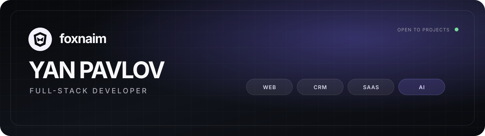
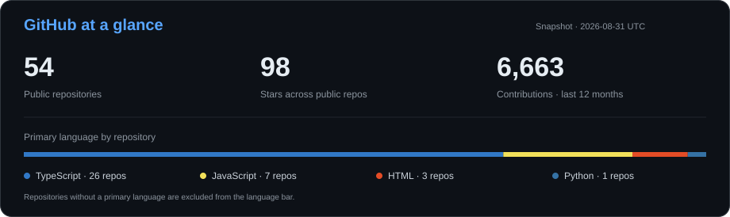
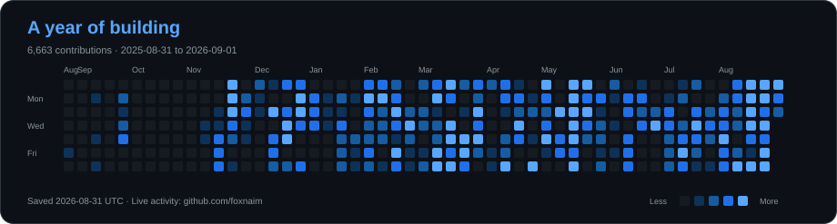

<div align="center">



[Портфолио](https://foxnaim.github.io/portfolio/) · [Проекты](https://foxnaim.github.io/portfolio/projects/) · [Как проходит работа](https://foxnaim.github.io/portfolio/process/) · [Instagram](https://www.instagram.com/yan._.pavlov/) · [Build with Yan](https://t.me/+cYtUBpTN-2FkZTky)

</div>

## Ян Павлов / About me

Full-stack разработчик и автор **foxnaim**. Увлекаюсь разработкой с 2017 года: ещё в школе начал писать скрипты и собирать интерфейсы. Сейчас создаю сайты, CRM, SaaS и AI-автоматизации, которые помогают бизнесу получать заявки и экономить время.

Работаю удалённо из Казахстана, часто бываю в Алматы, Павлодаре, Семее и Астане. Люблю интересные задачи и, если заказчик согласен, предлагаю дополнительные идеи для развития продукта и автоматизации.

- Беру продукт целиком: интерфейс, API, данные, интеграции и запуск.
- Обычный срок проекта — от **1 недели до 2 месяцев**, в зависимости от состава работ.
- Среди самостоятельных и командных проектов: **AI-Таргетолог, Imperial, One System и Leadflow**.
- Основной контакт для заказов — [Instagram @yan._.pavlov](https://www.instagram.com/yan._.pavlov/).

## Что разрабатываю

| Направление | Что входит |
| --- | --- |
| **Сайты и магазины** | Лендинги, корпоративные сайты, каталоги, формы и интеграции |
| **CRM и SaaS** | Личные кабинеты, роли, заявки, аналитика, API и базы данных |
| **AI и автоматизация** | AI-помощники, Telegram-боты, обработка данных и рабочие сценарии |
| **MVP под ключ** | Декомпозиция идеи, frontend, backend, запуск и передача исходников |

## Основной стек

```text
TypeScript · JavaScript · React · Next.js
Node.js · NestJS · REST API · WebSocket
PostgreSQL · MongoDB · Redis
Docker · GitHub Actions · AI/API integrations
```

## Избранные проекты

| Проект | Решение | Стек |
| --- | --- | --- |
| [**AI Lead Flow**](https://foxnaim.github.io/AI-Lead-Flow/) | Интерактивный концепт квалификации заявок, lead score и следующего действия | JavaScript, CRM concept |
| [**Slotix KZ**](https://foxnaim.github.io/Slotix-KZ/) | Макет онлайн-записи, расписания, мини-CRM и управления услугами | JavaScript, Booking concept |
| [**TazaOrder**](https://foxnaim.github.io/TazaOrder/) | Макет Telegram-магазина; портфельная адаптация открытого MIT-проекта | React, Telegram commerce |
| [**Tact**](https://github.com/foxnaim/World-Time-Frontend) | Учёт рабочего времени через Telegram и меняющиеся QR-коды | Next.js, NestJS, PostgreSQL |
| [**NeuroNotes**](https://github.com/foxnaim/NeuroNotes) | Пространство для заметок, задач и интерфейсов AI-функций | Next.js, TypeScript |
| [**Dev-flow**](https://github.com/foxnaim/Dev-flow) | Канбан, календарь, заметки и управление задачами | Next.js, MongoDB, NextAuth |
| [**feed Back**](https://github.com/foxnaim/Anonymous-chat) | Анонимная обратная связь и обновления в реальном времени | Next.js, Socket.IO |

Полный каталог с задачами и описанием решений: **[foxnaim.github.io/portfolio/projects](https://foxnaim.github.io/portfolio/projects/)**.

## GitHub snapshot

<a href="https://github.com/foxnaim?tab=repositories">
  
</a>

<sub>Дата обновления указана внутри карточки. Актуальные данные доступны в профиле GitHub.</sub>

## Activity

<a href="https://github.com/foxnaim?tab=overview">
  
</a>

## Как проходит работа

1. Коротко разбираем задачу, пользователей и желаемый результат.
2. Фиксируем первую версию, этапы, сроки и критерии готовности.
3. Разработка идёт с демонстрациями рабочих промежуточных версий.
4. Проверяем сценарии, запускаем продукт и передаём исходники.

Базовая схема оплаты: **30% старт · 40% рабочая версия · 30% запуск**. Условия адаптируются под задачу и фиксируются до начала работы.

<div align="center">

### Есть идея для проекта?

[**Написать в Instagram →**](https://www.instagram.com/yan._.pavlov/)

</div>
